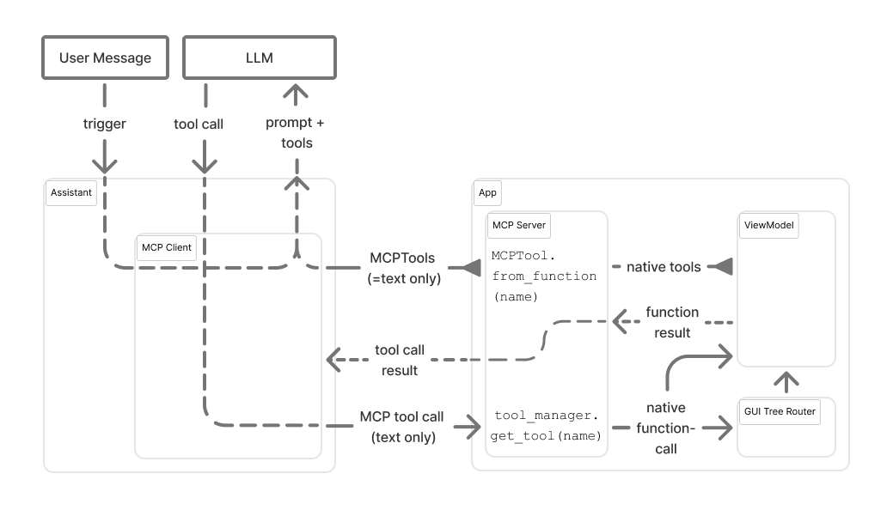
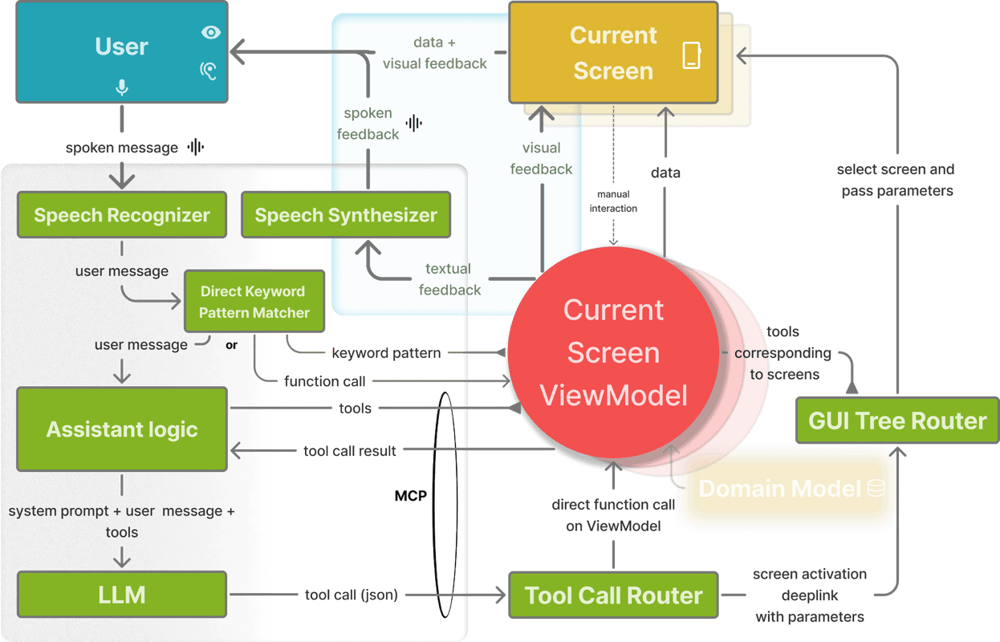

# Langbar Core

A Flutter library for natural language interface components that integrate with LLMs using LangChain.dart. Build voice and text-enabled AI interfaces with MVVM architecture. LLM and speech integration for voice interaction from within the app als well as from external assistants using MCP.
It showcases an architecture for interfacing between GUIs and LLM based conversational assistance as described in https://arxiv.org/abs/2510.06223.

## Features

- 🎤 **Voice-enabled LLM integration** with speech-to-text and text-to-speech
- 🏗️ **MVVM architecture** with `GenericScreenViewModel` base class
- 💉 **Dependency injection** via get_it for flexible configuration
- 🔧 **Multi-provider LLM support** (OpenAI, Groq, Ollama, OpenRouter)
- 🧰 **Auto-generated tools** from GoRouter navigation routes
- 💾 **Conversation history** with persistent storage
- 🎯 **Natural language input** via `LangField` widget
- 📱 **Cross-platform** Flutter support
- 🔌 **MCP (Model Context Protocol)** support for e.g. Claude Desktop integration

The following video demonstrates the MCP connection of the example app in this project to Claude Desktop:
**Switch sound ON to hear the TTS:**
[](https://www.youtube.com/watch?v=4pGmYHk1k1I)
https://github.com/user-attachments/assets/6b5a420d-b92c-4af9-a6c8-d64e8107c810

## Quick Start

### 1. Run the example

To run the example application:

Create a `.env` file in the example directory:

```env
OPENAI_API_KEY=your_openai_key_here
# Or other provider keys as needed
```

## To reuse the example in your own project

### Initialize in main()

```dart
import 'package:flutter_dotenv/flutter_dotenv.dart';
import 'package:langbar_core/langbar_core.dart';

void main() async {
  await dotenv.load();
  
  // Setup LLM with dependency injection
  setupLLMDependencyInjection(
    Service.openai, 
    systemPrompt: "You are a helpful assistant."
  );
  
  // Configure navigation routes for tool generation
  setRoutes(yourAppRoutes);
  
  runApp(MyApp());
}
```

### Use LangField Widget

```dart
import 'package:langbar_core/langbar_core.dart';

class MyScreen extends StatelessWidget {
  @override
  Widget build(BuildContext context) {
    return Scaffold(
      appBar: AppBar(title: Text('AI Assistant')),
      body: Column(
        children: [
          Expanded(child: HistoryView()),
          LangField(showHistoryButton: true),
        ],
      ),
    );
  }
}
```

### Create AI-enabled ViewModels

```dart
class MyScreenViewModel extends GenericScreenViewModel<MyScreenState> {
  MyScreenViewModel(super.initialState, {required super.context});
  
  // TTS service automatically available via inherited 'tts' property
  // Voice interaction enabled via SpeechEnabled mixin
  
  void handleUserAction() {
    // Your business logic here
    tts.speak("Action completed!");
  }
}
```

### Easier:
- clone this repo, e.g. to ~/myprojects/langbar_core
- get a subscription to an AI code CLI (Claude Code, Cursor CLI etc.).
- open the cli in your own project
- issue a prompt like: `"First read ~/myprojects/langbar_core/readme.md. Then make a plan to modify the flutter app in this package to include LLM based assistance by carefully analyzing the code of the example project in ~/myprojects/langbar_core/example. Analyze carefuly how you can apply the mechanism employed there to the current project. Pay special attention to the routes and viewmodels for screens in the example project. Make sure routes and screens in the project in the current directory follow the same strategy for exposing their functionality and handling of LLM responses."`
- after the plan is created, execute it and see how far you get.

## Connect your app to OS assistants using MCP:



https://github.com/user-attachments/assets/b20636a9-edf7-45e7-b74f-880c9b624a3e

## Project Overview

Langbar Core is a Flutter library for natural language interface components that integrate with LLMs using LangChain.dart. The architecture follows MVVM pattern where ViewModels serve as orchestrators between GUI and LLM assistants.

## Development Commands

Standard Flutter commands apply:
- `flutter pub get` - Install dependencies
- `flutter analyze` - Run static analysis
- `flutter test` - Run tests
- `flutter pub deps` - Show dependency tree

## Architecture


### Core Components

**MVVM Architecture**
- `GenericScreenViewModel<State>` in `lib/ui/cubits/generic_screen_view_model.dart` - Base ViewModel that extends Cubit and mixes in SpeechEnabled
- ViewModels register with `CurrentScreenCubit` for coordination
- Uses flutter_bloc for state management

**LLM Integration**
- `send_to_llm.dart` - Main LLM orchestration with support for OpenAI, OpenRouter, Ollama, and Groq
- `Service` enum defines available LLM providers
- System prompt configuration via dependency injection
- Route-based tool generation via `setRoutes()`
- Dependency injection using get_it for LLM instance and configuration management

**Natural Language Input**
- `LangField` widget in `lib/ui/langfield/langfield.dart` - Primary input component
- `LangBarState` provider manages input state
- Speech-to-text integration via `speech.dart`

**Tool System**
- `GenericScreenTool` - Creates LLM tools from GoRouter routes
- `RetrieverTool` - Vector database integration
- Tools are auto-generated from router configuration

### Key Directories

- `lib/ui/` - UI components, cubits, and scaffolds
- `lib/tools/` - LLM tool implementations
- `lib/data/` - Data models and LangChain integration utilities
- `lib/function_calling_v3/` - Latest function calling implementation
- `lib/utils/` - General utilities and extensions

## Important Files

**Configuration**
- `lib/llm_keys.dart` - API keys and provider configurations (git-ignored with skip-worktree)
- `lib/documented_route.dart` - Route documentation for tool generation

**Core Services**
- `lib/send_to_llm.dart` - Main LLM service orchestrator
- `lib/my_conversation_buffer_memory.dart` - Custom conversation memory implementation
- `lib/langbar_history_storage.dart` - Persistent conversation history

## Supported LLM Providers

| Provider | Service Enum | Environment Variable |
|----------|--------------|---------------------|
| OpenAI | `Service.openai` | `OPENAI_API_KEY` |
| Groq | `Service.groq` | `GROQ_API_KEY` |
| OpenRouter | `Service.openrouter` | `OPENROUTER_API_KEY` |
| Ollama | `Service.ollama` | Local installation |

## Dependencies

Key external dependencies:
- `langchain: ^0.7.6` - Core LLM framework
- `langchain_openai: ^0.7.6+1` - OpenAI integration
- `langchain_ollama: ^0.3.3+2` - Local Ollama integration
- `flutter_bloc: ^9.1.1` - State management
- `go_router: ^16.2.1` - Navigation
- `speech_to_text: ^7.3.0` - Voice input
- `flutter_tts: ^4.2.3` - Text-to-speech output
- `get_it: ^7.7.0` - Dependency injection

## Contributing

1. Fork the repository
2. Create your feature branch (`git checkout -b feature/amazing-feature`)
3. Commit your changes (`git commit -m 'Add some amazing feature'`)
4. Push to the branch (`git push origin feature/amazing-feature`)
5. Open a Pull Request

## License

This project is licensed under the MIT License - see the LICENSE file for details.
